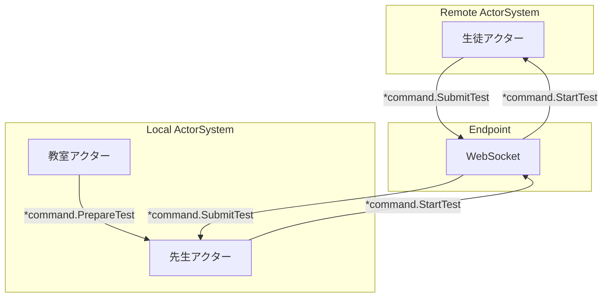

# remote-kinds

php actor model toolkit [phluxor-remote](https://github.com/ytake/phluxor-remote) example.

remote actor system communication example.



[日本語での仕組み解説はこちら](https://blog.ytake.jp.net/entry/2024/10/02/090000)

Proto Actor(Go)と同様の仕組みで、リモートアクターシステムとの通信を行うことができます。  
ただしPHPの特性上、パフォーマンスはそこまで高くありません。  
あくまで学習や理解のためのツールキットとして利用してください。

## Composer

```bash
$ docker compose up -d 
$ docker compose exec node1 composer install
```

### node1

```bash
$ docker compose exec node1 php node1.php
```

The output will be as follows(node1).

```bash
[2024-10-02T22:56:44.405705+09:00] Phluxor.INFO: actor system started {"id":"GUAVCBf3N9sBbv2bLD7vJV"} []
[2024-10-02T22:56:44.409965+09:00] Phluxor.INFO: Started Activator [] []
[2024-10-02T22:56:44.411845+09:00] Phluxor.INFO: Started EndpointManager [] []
[2024-10-02T22:56:44.412722+09:00] Phluxor.INFO: Starting Phluxor remote server {"address":"localhost:50052"} []
```

### node2

```bash
$ docker compose exec node2 php node2.php
```

The output will be as follows(node2).

```bash
[2024-10-02T22:56:47.465391+09:00] Phluxor.INFO: actor system started {"id":"G9gLzYTJF7owcR7oPgAcL5"} []
[2024-10-02T22:56:47.469438+09:00] Phluxor.INFO: Started Activator [] []
[2024-10-02T22:56:47.471169+09:00] Phluxor.INFO: Started EndpointManager [] []
[2024-10-02T22:56:47.472013+09:00] Phluxor.INFO: Starting Phluxor remote server {"address":"localhost:50053"} []
[2024-10-02T22:56:47.476064+09:00] Phluxor.INFO: Teacher has issued a math test [] []
[2024-10-02T22:56:47.479811+09:00] Phluxor.INFO: Started WebSocket.EndpointWriter. connecting {"address":"localhost:50052"} []
[2024-10-02T22:56:47.480119+09:00] Phluxor.INFO: Started EndpointWatcher {"address":"localhost:50052"} []
[2024-10-02T22:56:47.494494+09:00] Phluxor.INFO: WebSocket.EndpointWriter connected {"address":"localhost:50052"} []
[2024-10-02T22:57:16.560003+09:00] Phluxor.INFO: The class has ended: math [] []
```

start the actor system and send a message to the remote actor system.

The output will be as follows(node1).

```bash
[2024-10-02T22:56:54.500201+09:00] Phluxor.INFO: activator/Remote$student-3 is submitting the answer to the math test [] []
[2024-10-02T22:56:54.503459+09:00] Phluxor.INFO: activator/Remote$student-5 is submitting the answer to the math test [] []
[2024-10-02T22:56:54.508781+09:00] Phluxor.INFO: activator/Remote$student-6 is submitting the answer to the math test [] []
[2024-10-02T22:56:54.972123+09:00] Phluxor.INFO: activator/Remote$student-1 is submitting the answer to the math test [] []
[2024-10-02T22:56:55.497815+09:00] Phluxor.INFO: activator/Remote$student-2 is submitting the answer to the math test [] []
[2024-10-02T22:56:58.501091+09:00] Phluxor.INFO: activator/Remote$student-4 is submitting the answer to the math test [] []
[2024-10-02T22:56:59.511922+09:00] Phluxor.INFO: activator/Remote$student-8 is submitting the answer to the math test [] []
[2024-10-02T22:56:59.518704+09:00] Phluxor.INFO: activator/Remote$student-10 is submitting the answer to the math test [] []
[2024-10-02T22:57:00.515895+09:00] Phluxor.INFO: activator/Remote$student-9 is submitting the answer to the math test [] []
[2024-10-02T22:57:02.510082+09:00] Phluxor.INFO: activator/Remote$student-7 is submitting the answer to the math test [] []
[2024-10-02T22:57:02.519876+09:00] Phluxor.INFO: activator/Remote$student-11 is submitting the answer to the math test [] []
[2024-10-02T22:57:03.521729+09:00] Phluxor.INFO: activator/Remote$student-12 is submitting the answer to the math test [] []
[2024-10-02T22:57:05.535544+09:00] Phluxor.INFO: activator/Remote$student-16 is submitting the answer to the math test [] []
[2024-10-02T22:57:07.525192+09:00] Phluxor.INFO: activator/Remote$student-13 is submitting the answer to the math test [] []
[2024-10-02T22:57:11.531273+09:00] Phluxor.INFO: activator/Remote$student-14 is submitting the answer to the math test [] []
[2024-10-02T22:57:12.534601+09:00] Phluxor.INFO: activator/Remote$student-15 is submitting the answer to the math test [] []
[2024-10-02T22:57:12.541324+09:00] Phluxor.INFO: activator/Remote$student-17 is submitting the answer to the math test [] []
[2024-10-02T22:57:12.551969+09:00] Phluxor.INFO: activator/Remote$student-19 is submitting the answer to the math test [] []
[2024-10-02T22:57:14.546994+09:00] Phluxor.INFO: activator/Remote$student-18 is submitting the answer to the math test [] []
[2024-10-02T22:57:16.558151+09:00] Phluxor.INFO: activator/Remote$student-20 is submitting the answer to the math test [] []
```
